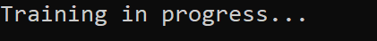
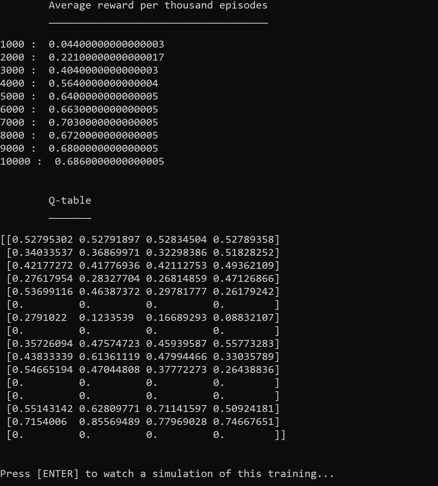
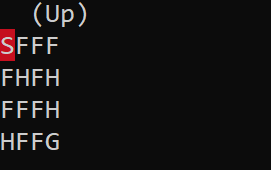
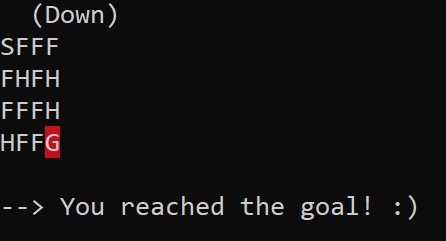

# FROZEN-LAKE 

Reinforcement Learning (Q-learning) project inspired by the deeplizard tutorial.

## :dart: Objective

The agent controls the movement of a character in a grid world. Some tiles of the grid are walkable, and others lead to the agent falling into the water. Additionally, the movement direction of the agent is uncertain and only partially depends on the chosen direction. The agent is rewarded for finding a walkable path to a goal tile.

Source: https://gym.openai.com/envs/FrozenLake-v0/

## :snowflake: Description

*Winter is here. You and your friends were tossing around a frisbee at the park when you made a wild throw that left the frisbee out in the middle of the lake. The water is mostly frozen, but there are a few holes where the ice has melted. If you step into one of those holes, you'll fall into the freezing water. At this time, there's an international frisbee shortage, so it's absolutely imperative that you navigate across the lake and retrieve the disc. However, the ice is slippery, so you won't always move in the direction you intend.*

*The surface is described using a grid like the following:*
```
SFFF       (S: starting point, safe)  
FHFH       (F: frozen surface, safe)
FFFH       (H: hole, fall to your doom)
HFFG       (G: goal, where the frisbee is located)
```

*The episode ends when you reach the goal or fall in a hole. You receive a reward of 1 if you reach the goal, and zero otherwise.*

## :rocket: How to start the game?

To download and install the dependencies:
```
pip install -r requirements.txt
```
To launch the game:
```
python game.py
```

## :eyes: Overview

Training:



Results:



Simulation of an episode:



End of a winning episode:




